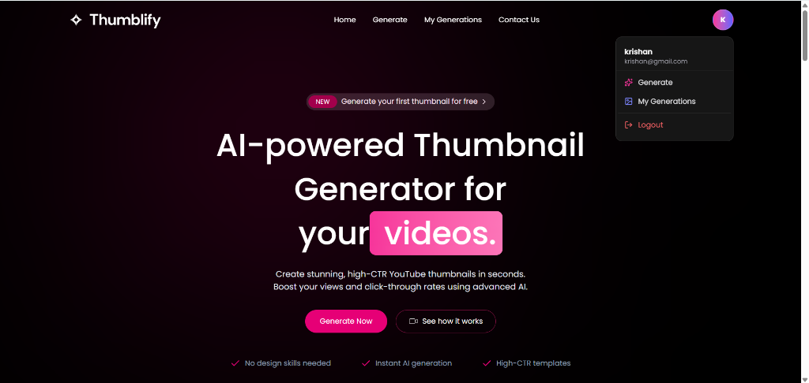
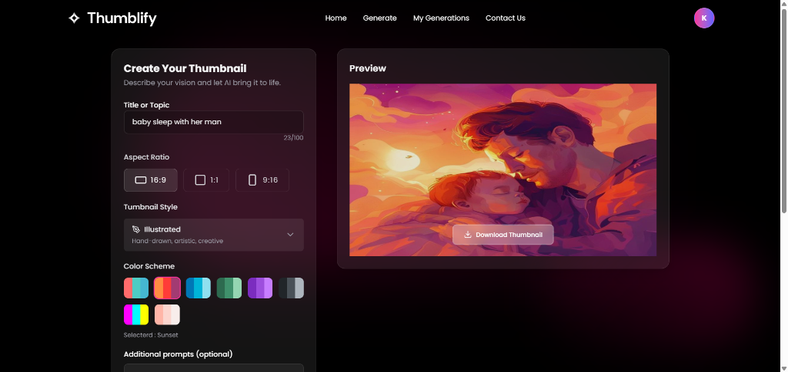

# Thumblify - AI Thumbnail Generator 🎨✨

Welcome to **Thumblify**, the ultimate AI-powered YouTube thumbnail generator. Built with modern web technologies, Thumblify allows creators to instantly generate visually stunning, highly clickable thumbnails using state-of-the-art AI models, without needing any graphic design skills!

---

## 📸 Screenshots

### 1. Homepage & User Menu


### 2. AI Thumbnail Generation Panel


---

## 🚀 Application Functions & Features

### 1. Secure Authentication & User Management
* **User Accounts**: Create a personal account via the custom register form and sign in securely.
* **Session Persistence**: Sessions are saved and managed securely to keep you logged in.
* **User Profile**: Quick-access profile dropdown in the navigation bar to view your account details, navigate to your generations, or log out.

### 2. AI Thumbnail Generation
* **Custom Prompts**: Input your video title and any additional details/prompts to guide the AI.
* **Aspect Ratio Selection**: Support for multiple formats:
  * **16:9** (YouTube Videos / Widescreen)
  * **1:1** (Instagram / Square)
  * **9:16** (YouTube Shorts / TikTok / Reels)
* **Visual Style Selector**: Choose from various artistic styles:
  * *Bold & Graphic*
  * *Tech/Futuristic*
  * *Minimalist*
  * *Photorealistic*
  * *Illustrated*
* **Curated Color Schemes**: Select color palettes to match your brand (Vibrant, Sunset, Forest, Neon, Purple, Monochrome, Ocean, Pastel).
* **Text Overlay**: Add custom text overlay instructions for the AI to embed directly onto the thumbnail.
* **High-Quality AI Engine**: Uses the state-of-the-art **FLUX.1-schnell** model via Hugging Face for fast, sharp, and highly relevant image outputs.

### 3. My Generations Dashboard
* **Thumbnail Gallery**: View all your previously generated thumbnails in a responsive grid layout.
* **Instant Downloads**: Download your generated thumbnails directly to your device with a single click.
* **Thumbnail Management**: Delete unwanted thumbnails from your history to keep your gallery clean.

### 4. Interactive Pricing & Credit System
* **Credit-Based Generation**: Each thumbnail generation consumes 1 credit.
* **Flexible Plans**:
  * **Basic (Free - $0)**: Claim 5 free credits (one-time claim per account).
  * **Pro ($3)**: Purchase 100 credits.
  * **Enterprise ($5)**: Purchase 500 credits.
* **Seamless Payments**: Fully integrated with **Stripe Checkout** for purchasing credits.
* **Direct Activation**: Free plan credits are claimed and credited instantly without leaving the app.

### 5. Contact & Support Form
* **Get in Touch**: Public contact form allowing users to send messages, questions, or feedback.
* **Email Notifications**: Form submissions are instantly formatted into a premium HTML email and sent to the administrator.

### 6. Premium UI/UX Details
* **Global Toast Notifications**: Real-time feedback for authentication, generation, payment redirects, and form submissions using `react-hot-toast`.
* **Cross-Page Smooth Scrolling**: Smooth, seamless navigation to homepage sections (Features, Pricing, Testimonials, Contact) from any other page in the app.
* **Responsive Layouts**: Designed to look stunning and function flawlessly across Mobile, Tablet, and Desktop displays.

---

## 🛠️ Tech Stack

### Frontend (Client)
* **Framework**: React 19 (Vite)
* **Routing**: React Router DOM
* **Styling**: TailwindCSS
* **Animations**: Framer Motion
* **Notifications**: React Hot Toast
* **Smooth Scroll**: Lenis Scroll

### Backend (Server)
* **Runtime**: Node.js & Express.js
* **Database**: MongoDB (Mongoose)
* **Payments**: Stripe
* **Email Service**: Nodemailer (SMTP)
* **Image Hosting**: Cloudinary

---

## 📂 Project Structure

```text
Ai_thambnail/
├── client/              # React Frontend
│   ├── public/          # Static assets (logo, favicon, screenshots, etc.)
│   ├── src/             # Source files
│   │   ├── components/  # Reusable UI components
│   │   ├── pages/       # Route-based pages (Generate, MyGeneration, etc.)
│   │   ├── sections/    # Homepage sections
│   │   └── assets/      # Local assets and data files
│   └── package.json
├── server/              # Express Backend
│   ├── configs/         # Database, Stripe, and Cloudinary configurations
│   ├── controllers/     # API logic (ThumbnailController, AuthControllers, etc.)
│   ├── models/          # Database schemas (User, Thumbnail)
│   ├── routes/          # Express route definitions
│   ├── middlewares/     # Authentication middlewares
│   ├── services/        # Email notification services (Nodemailer)
│   └── server.ts        # Entry point
└── screenshots/         # App screenshots for GitHub README
```

---

## ⚙️ Getting Started

### 1. Install Dependencies
Install dependencies in both the `client` and `server` directories:
```bash
# In the client folder
cd client
npm install

# In the server folder
cd ../server
npm install
```

### 2. Run the App
Run both servers simultaneously:

**Start the Backend:**
```bash
cd server
npm start
```

**Start the Frontend:**
```bash
cd client
npm run dev
```

Visit `http://localhost:5173` to see your app live! 🎉

